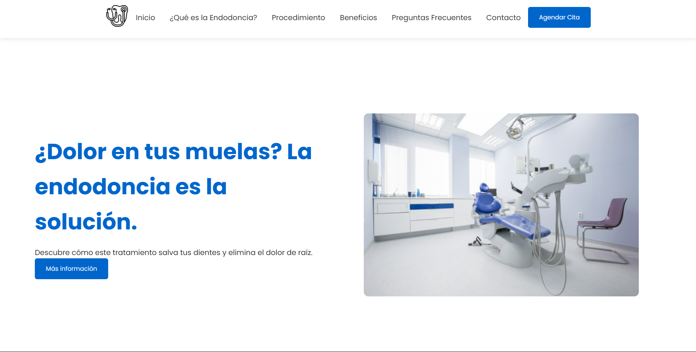

# 🦷 Endodoncia en Molares - Website


## 📋 Table of Contents

- [🦷 Endodoncia en Molares - Website](#-endodoncia-en-molares---website)
  - [📋 Table of Contents](#-table-of-contents)
  - [🎯 Overview](#-overview)
    - [🖥️ Live Demo](#️-live-demo)
  - [✨ Features](#-features)
  - [🛠️ Technologies](#️-technologies)
  - [📦 Installation](#-installation)
  - [📁 Project Structure](#-project-structure)
  - [💻 Usage](#-usage)
    - [Local Development](#local-development)
    - [Deployment](#deployment)
  - [🤝 Contributing](#-contributing)
    - [Contribution Guidelines](#contribution-guidelines)
  - [📄 License](#-license)
  - [📞 Contact](#-contact)

## 🎯 Overview

A modern, responsive single-page website for a dental endodontics practice. The site provides comprehensive information about molar endodontic treatments, procedures, and patient care.

### 🖥️ Live Demo

[View Demo](https://endodoncia-molares.devprojects.tech)



## ✨ Features

- **📱 Responsive Design**: Fully responsive layout that works on all devices
- **🎨 Modern UI/UX**: Clean and professional design with smooth animations
- **⚡ Performance**: Optimized for fast loading and smooth scrolling
- **♿ Accessibility**: WCAG compliant for better accessibility
- **🔍 SEO**: SEO-friendly structure and metadata

## 🛠️ Technologies

| Category | Technologies |
|----------|-------------|
| Frontend |   |
| Icons |  |
| Fonts |  |

## 📦 Installation

1. Clone the repository:

    ```bash
    git clone https://github.com/sandovaldavid/Endodoncia-Molares.git
    ```

2. Navigate to project directory:

    ```bash
    cd Endodoncia-Molares
    ```

3. Open in your preferred browser:

    ```bash
    # Using Python's HTTP server
    python -m http.server 8000

    # Using PHP's built-in server
    php -S localhost:8000
    ```

## 📁 Project Structure

``` text
endodoncia-website/
├── images/
│   ├── logo.png
│   ├── bg-hero.jpg
│   └── user.png
├── styles/
│   └── style.css
├── index.html
└── README.md
```

## 💻 Usage

### Local Development

1. Make changes to HTML/CSS files
2. Refresh browser to see changes
3. Test responsiveness using browser dev tools

### Deployment

Deploy to any static hosting service:

- GitHub Pages
- Netlify
- Vercel
- Amazon S3

## 🤝 Contributing

Contributions are welcome! Please follow these steps:

1. Fork the repository
2. Create a feature branch (`git checkout -b feature/AmazingFeature`)
3. Commit changes (`git commit -m 'Add AmazingFeature'`)
4. Push to branch (`git push origin feature/AmazingFeature`)
5. Open a Pull Request

### Contribution Guidelines

- Follow existing code style
- Update documentation as needed
- Test all changes thoroughly
- Add comments for complex code

## 📄 License

This project is licensed under the MIT License - see the LICENSE.md file for details.

## 📞 Contact

Project Maintainer - [@sandovaldavid](https://github.com/sandovaldavid)

Project Link: [https://github.com/sandovaldavid/Endodoncia-Molares](https://github.com/sandovaldavid/Endodoncia-Molares)

---

<div align="center">

Made by [@sandovaldavid](https://devsandoval.me/)

</div>
